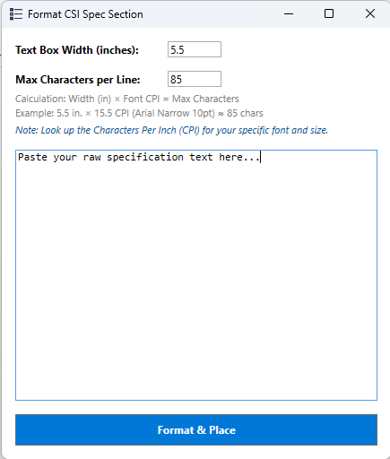

# pyRevit-SpecText
Converts CSI Masterspec text into a single native Revit text column with a set width.

---

## Installation & Setup Workflow

Please complete the following steps to get the plugin installed and configured.

1. [Step 1: Install via pyRevit Extension Manager](#step-1-install-via-pyrevit-extension-manager)
2. [Step 2: Run the Extension](#step-2-run-the-extension)
3. [Keeping the Tool Updated](#keeping-the-tool-updated)

---

### Step 1: Install via pyRevit Extension Manager

You can install this extension directly from this GitHub repository using pyRevit's built-in tools.

1. Open Revit and navigate to the `pyRevit` tab on the ribbon.
2. Click the `pyRevit` drop-down menu (small triangle icon next to "pyRevit") and select `Extensions`.
3. In the Extension Manager window, paste this repository's Git URL into the GIT URL field:
   `https://github.com/burnished-edge/pyRevit-SpecText.git`
4. Provide a name for the tool if prompted, then click `Add and install`. 
5. Once the installation completes, close the Extension Manager and click `Reload` in the pyRevit ribbon menu. The new ribbon button panel will generate on your screen.

---

### Step 2: Run the Extension

1. Click your newly loaded `SpecText` button on the Revit ribbon.
2. A window will pop up for you to paste your raw CSI Masterspec formatted text in. 
3. Parameters include `Text Box Width` and `Max Characters per Line` You'll need to Google the number of characters that will fit per line within your given text box width. Searching "character per line for X font at X font height" should give you what you need.
4. Click `Format & Place`. You will be prompted for an insertion point to place the text box. You may need to nudge the width of the text box as the characters per line parameter might still cause whole words to wrap unintentionally.
5. Break up this text column as needed -- you'll need to copy and paste the text column in Revit as Revit does not support multi-column text.

> ** Note**: The text generated from this tool should be treated as disposable. There is no text wrapping -- every line is formed separately so the indents from the CSI masterspec formatting is preserved. If updates are needed, make the updates to the raw text and then paste it into the tool to generate a new text box..

---

## Keeping the Tool Updated

Because the extension is linked directly to GitHub via pyRevit, applying future updates is simple. Whenever a new version or bug fix is pushed to this repository:

1. Click the `pyRevit` drop-down menu (small triangle icon next to "pyRevit") and select `Update`. pyRevit will pull the latest source code from GitHub and apply the changes.
